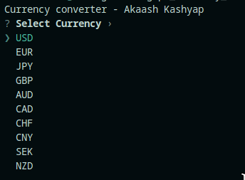
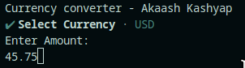
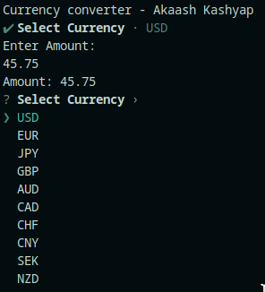
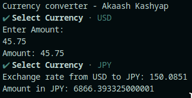

# Project 2 - Currency Exchange
Project statement: Develop a program to convert currency X to currency Y and visa versa (beginner).

## Features
- Supports 10 Currencies
- Currency Selection UI
- Dynamic URL construction
- Uses API from [ExchangeRate](https://www.exchangerate-api.com/)
- Follows safe API storage requirements

## Usage
```
cargo run # starts the program
```
1. First select starting currency

  <div style="text-align: center;">
    
  </div>

2. Then choose amount of money to convert

    <div style="text-align: center;">
    
    </div>

3. Select second currency to convert to

    <div style="text-align: center;">
    
    </div>

4. And we are done, we have the current exchange rate and the money in the target currency.

    <div style="text-align: center;">
    
    </div>
